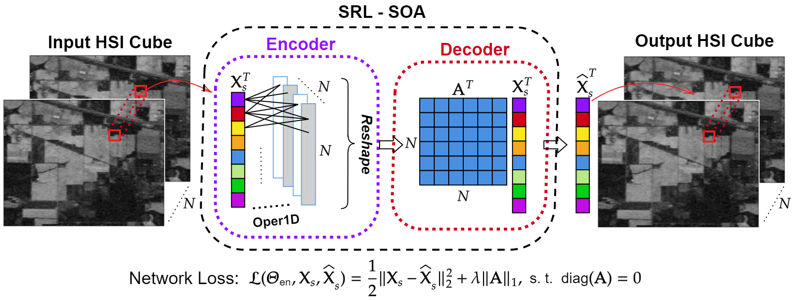

Hyperspectral Band Selection using Self-Representation Learning with Sparse 1D-Operational Autoencoder (SRL-SOA)
=============================

This repository includes the implentation of the hyperspectral image (HSI) band selection method in [SRL-SOA: Self-Representation Learning with Sparse 1D-Operational Autoencoder for Hyperspectral Image Band Selection](https://arxiv.org/abs/2202.09918).



Software environment:
```
# Python with the following version and libraries.
python == 3.7.9
tensorflow == 2.4.1
Numpy == 1.21.2
argparse == 1.1
SciPy == 1.6.2
scikit-learn == 0.23.2
scikit-feature == 1.1.0 # For ISSC method (pip install skfeature-chappers==1.1.0)
munkres == 1.1.4 # For EGCSR method (pip install munkres==1.1.4)
```
Creating the environment using conda:
```
conda create -n srl-soa python=3.7
conda activate srl-soa
conda install tensorflow-gpu=2.4.1
conda install scikit-learn=0.23.2
pip install skfeature-chappers==1.1.0
pip install munkres==1.1.4
```

## Citation

If you use the provided method in this repository, please cite the following paper:

```
@INPROCEEDINGS{ahishali2022srlsoa,
  author={Ahishali, Mete and Kiranyaz, Serkan and Ahmad, Iftikhar and Gabbouj, Moncef},
  booktitle={2022 IEEE International Conference on Image Processing (ICIP)}, 
  title={SRL-SOA: Self-Representation Learning with Sparse 1D-Operational Autoencoder for Hyperspectral Image Band Selection}, 
  year={2022},
  pages={2296-2300},
  doi={10.1109/ICIP46576.2022.9897863}}
```

## Downloading the HSI Datasets

In the experiments, the Indian Pines and Salinas-A HSI datasets are used and they are accessible from [here](http://www.ehu.eus/ccwintco/index.php/Hyperspectral_Remote_Sensing_Scenes).

Downloading the Indian Pines, Salinas-A scenes, and corresponding ground-truth data:
```
wget http://www.ehu.eus/ccwintco/uploads/6/67/Indian_pines_corrected.mat
wget http://www.ehu.eus/ccwintco/uploads/c/c4/Indian_pines_gt.mat
wget http://www.ehu.eus/ccwintco/uploads/1/1a/SalinasA_corrected.mat
wget http://www.ehu.eus/ccwintco/uploads/a/aa/SalinasA_gt.mat
```
Place them under the ```data``` folder:
```
mkdir data
mv *mat data/
```

## Band Selection using SRL-SOA

The proposed SRL-SOA method can be run for the band selection as follows,
```
python main.py --dataset Indian_pines_corrected --method SRL-SOA --q 3 --bands 25
```
You can specify the dataset ```Indian_pines_corrected``` or ```SalinasA_corrected```, polynomial order (see [Operational Layers](https://arxiv.org/abs/2106.14208)) ```--q```, and the selected number of bands ```--bands```. The weights of the SRL-SOA are already provided under ```weights/``` folder to reproduce the reported results in the paper. If you desire to train them from scratch, ```--weights``` argument should be set to ```False```:
```
python main.py --dataset Indian_pines_corrected --method SRL-SOA --weights False --q 3 --bands 25
```
Note that once the network training is finished, the same network can be tested using different number of bands (```--bands```) with the same ```q``` value. Hence, you only re-train the network if you change the  ```q``` value.

After the band selection, the classification is performed using SVM classifier and the SVM parameters are searched via the grid search. The parameter search can be disabled by setting ```parameterSearch = False``` in ```main.py```. 

If you desire to skip the band selection procedure, set ```--method None```. In this way, the classifier uses all the available bands:
```
python main.py --dataset Indian_pines_corrected --method None 
```

## Compare with Other Band Selection Methods

For the performance comparison with SRL-SOA, the provided ```main.py``` supports the following band selection methods: Principal Component Analysis (PCA), Sparse Representation based Band Selection (SpaBS) [1], Efficient Graph Convolutional Self-Representation (EGCSR) [2], and Improved Sparse Subspace Clustering (ISSC) [3]. Similarly, they can be evaluated by setting the following arguments: ```--method```, ```--dataset``` (```Indian_pines_corrected``` or ```SalinasA_corrected```), and number of bands  by ```--bands```. Using PCA method:

```
python main.py --method PCA --dataset Indian_pines_corrected --bands 25
```
On the other hand, the following repositories are needed for SpaBS, EGCSR, and ISSC:
```
git clone https://github.com/AngryCai/BandSelection.git
git clone https://github.com/AngryCai/GCSR-BS
mv -f GCSR-BS/ GCSR_BS/
```
Then, similarly, the evaluation of the methods can be performed:
```
python main.py --method SpaBS --dataset Indian_pines_corrected --bands 25
python main.py --method EGCSR_R --dataset Indian_pines_corrected --bands 25
python main.py --method ISSC --dataset Indian_pines_corrected --bands 25
```

## References
[1] S. Li and H. Qi, "Sparse representation based band selection for hyperspectral images," *in IEEE Int. Conf. Image Process.*, 2011, pp. 2693–2696. \
[2] Y. Cai, Z. Zhang, X. Liu, and Z. Cai, "Efficient graph convolutional self-representation for band selection of hyperspectral image," *IEEE J. Sel. Topics Appl. Earth Observ. Remote Sens.*, vol. 13, pp. 4869–4880, 2020. \
[3] W. Sun, L. Zhang, B. Du, W. Li, and Y. M. Lai, "Band selection using improved sparse subspace clustering for hyperspectral imagery classification," *IEEE J. Sel. Topics Appl. Earth Observ. Remote Sens.*, vol. 8, no. 6, pp. 2784–2797, 2015.
